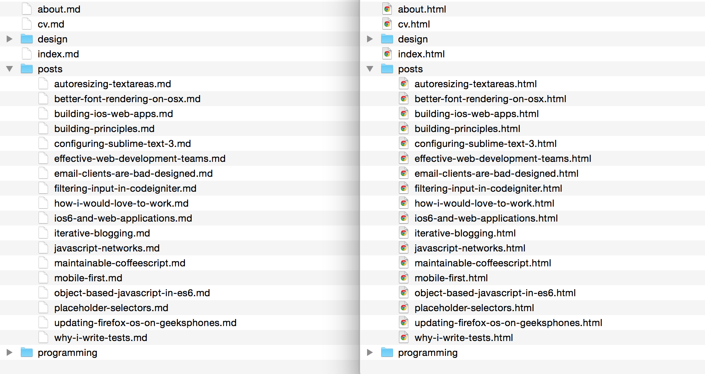

yaml-markdown-to-html [![version][1]][2]
=======================

“Bring your own libraries“ ~100 LOC static site generator

This CLI tool can turn any folder of markdown files with YAML front matter to HTML.

You only need to provide an async render function to the generator, which takes the raw markdown string and converts it to HTML. Use any markdown library and rendering library you want, make HTTP request to fetch data from an API or do some other asynchronous processes. As long as the function returns with a Promise that contains the final HTML as a string, it can output the files for you.

__Example:__


Installation
------------

```bash
yarn add yaml-markdown-to-html --dev
npm i yaml-markdown-to-html --save-dev
```

Usage
-----

The command line interface accepts three folders:

```bash
yaml-markdown-to-html <content> <public> <render>
```

`<content>` is the source folder that contains the markdown files to render

`<public>` is the destination folder that will contain the rendered html files

`<render>` is the folder, which contains at least a `render.js` and may contain a `post-render.js`, as well as other files that are used to render the markdown files to html. By default the CLI will look for a folder with the same name as the argument if omitted.

`render/render.js` is called once per file and gets an object with its parsed meta data and the raw markdown string, a collection of all other files in the current directory plus index pages of folders in the current directory and a collection of all files. It should return a Promise that fulfills with the rendered HTML.

__example:__ `render/render.js`

```js
export default async function render(currentFile, filesInCurrentFolder, allFiles) {
  return '<code>'
      +JSON.stringify(currentFile, null, 2)+' of '+allFiles.length
      +'\n'
      +JSON.stringify(filesInCurrentFolder, null, 2)
    +'</code>';
};
```

`render/postRender.js` receives a collection of rendered files including a `renderedPath` property after all files have been rendered and should return a Promise that fulfills whenever it is done.

__example:__ `render/post-render.js`

```js
export default async function postRender(renderedFiles) {
  console.log('number of rendered files: %i', renderedFiles.length);
  return renderedFiles;
};
```

LICENSE
-------

The MIT License (MIT) Maximilian Hoffmann

[1]: http://img.shields.io/npm/v/yaml-markdown-to-html.svg?style=flat
[2]: https://www.npmjs.org/package/yaml-markdown-to-html
